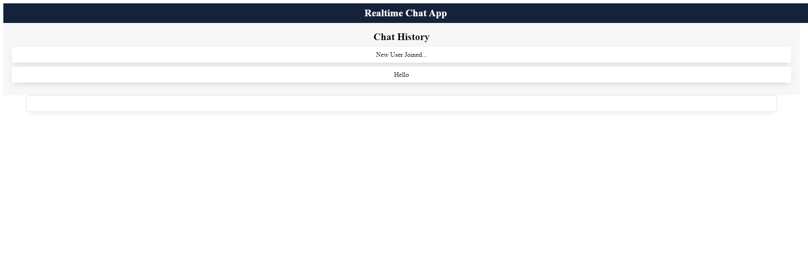

<h1 align="center">Real Time Chat System</h1>

<p align="center">
 <a href="#how-to-run">How to run</a> • 
 <a href="#tests">Tests</a> • 
 <a href="#libraries-and-tools">Libraries and Tools</a> • 
 <a href="#author">Author</a>
</p>



<p align="center" id="description">Real time chat system with React, Golang and WebSockets</p>

## How to run

### Requirements

- [Docker engine](https://docs.docker.com/engine/install)
- [Node 18.16.0](https://nodejs.org/en/blog/release/v18.16.0)

1. Clone the project

```bash
https://github.com/RianNegreiros/go-chat-system.git
```

2. Build the backend

```bash
  cd backend && docker build -t backend .
```

3. Run the backend

```bash
  docker run -it -p 8080:8080 backend
```

4. Install frontend dependencies

```bash
  cd ../frontend && npm install
```

5. Run the frontend

```bash
npm start
```

## Tests

```bash
go test ./...
```

## Libraries and Tools

- [Golang](https://go.dev/doc/install)
- [React](https://react.dev/learn)
- [SASS](https://sass-lang.com/install)
- [Gorilla WebSocket](https://github.com/gorilla/websocket)

### Author

<sub id="author"><b>Rian Negreiros Dos Santos</b></sub></a>

[](https://www.linkedin.com/in/riannegreiros/) 

[](mailto:riannegreiros@gmail.com)